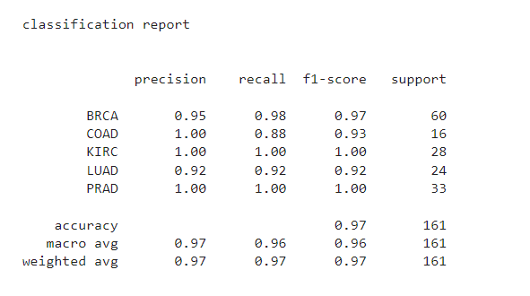
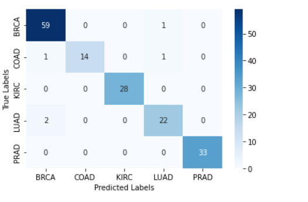
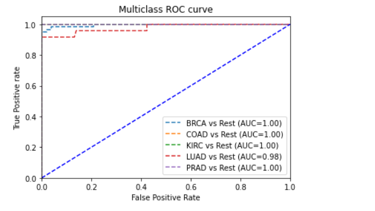

# Cancer-Prediction-using-Gene-Expression-Data
This is a bioinformatics ML project that help to predict cancer type from gene expression data

## Understanding Gene Expression Data

Gene expression data is a crucial source of information for understanding cellular processes and identifying disease biomarkers. It measures the activity of genes, which in turn influences the production of proteins and ultimately the behavior of cells. In the context of cancer, analyzing gene expression patterns can help identify genes that are overexpressed or underexpressed in cancerous cells compared to normal cells.

**Common Machine Learning Techniques for Cancer Prediction**

**Support Vector Machines (SVMs)**: SVMs are powerful algorithms that create a hyperplane to separate data points into different classes (e.g., cancerous vs. non-cancerous).

**Decision Trees and Random Forests**: These algorithms build models based on a series of decision rules, making them interpretable. Random forests combine multiple decision trees to improve accuracy and reduce overfitting.

**Neural Networks**: Deep learning architectures, like convolutional neural networks (CNNs), have shown promise in analyzing image-like data (e.g., gene expression data visualized as images).

**Bayesian Networks**: These probabilistic models represent relationships between variables, making them suitable for understanding complex biological systems.

**Ensemble Methods**: Combining multiple models (e.g., bagging, boosting) can often improve prediction accuracy.

## Scikit-learn (sklearn): A Powerful Machine Learning Library
Scikit-learn is a widely used Python library for machine learning, offering a vast array of algorithms and tools for tasks such as classification, regression, clustering, and dimensionality reduction. Its user-friendly interface and extensive documentation make it accessible to both beginners and experienced practitioners.

Sklearn provides a comprehensive set of algorithms for various machine learning tasks, including:
**Classification**: Naive Bayes, Support Vector Machines (SVM), Decision Trees, Random Forests, Gradient Boosting, etc.
**Regression**: Linear Regression, Ridge Regression, Lasso Regression, Elastic Net, Decision Trees, Random Forests, etc.
**Clustering**: K-means, Hierarchical Clustering, DBSCAN, etc.

## Data
Data used for this ML project is an RNA-Seq gene expression data for diffrent cancer type

## Approach

### Libraries Used
* numpy
* matplotlib
* seaborn
* pandas
* scikit

## Data Preprocessing
Data preprocessing is a crucial step in machine learning, ensuring that the data is in a suitable format for model training and evaluation. It involves various techniques to clean, transform, and normalize data.

**Splitting Data into Training and Testing Sets**
train_test_split divides the data into training and testing sets, ensuring that the model is evaluated on unseen data

**Encoding Categorical Variables**
LabelEncoder converts ordinal categorical variables into numerical labels.
LabelBinarizer creates one-hot encoded representations for nominal categorical variables.

**Scaling Numerical Features:**
MinMaxScaler scales numerical features to a specific range (e.g., 0 to 1), making them comparable

**Handling Missing Values**
Imputation: Replace missing values with mean, median, mode, or predicted values.
Deletion: Remove rows or columns with missing values.

**Feature Selection**
Feature selection is a critical pre-processing step employed to identify and retain the most relevant features for the classification task. This process aims to reduce the dimensionality of the data while preserving its informative content. In this instance, the mutual information algorithm is leveraged to quantify the degree of association between each feature and the target variable. Subsequently, the top n features (e.g., 300) exhibiting the strongest relationships are chosen for further machine learning analysis.

**Classification**
Our machine learning approach leverages a random forest classifier, a well-suited algorithm for handling the project's inherently high-dimensional and multiclass data. This ensemble learning method trains a multitude of decision trees, each analyzing a random subset of features. The final classification is determined by aggregating the predictions from these individual trees, leading to a robust and accurate model

**Model Training**
The training process empowers a machine learning model to extract knowledge from data. This acquired knowledge allows the model to generate predictions for unseen data by identifying and leveraging underlying patterns. During this critical phase, the model is exposed to a designated training subset. For the purposes of this tutorial, we will employ the Random Forest Classifier algorithm.

**Model Evaluation**
After training the model, it is important to know how the model performs on an independent data(i.e. the test data). The following metrics are used to evaluate the model

* accuracy
* precision
* recall
* f1 score
* confusion matrix
* ROC Curve

## Q & A

**Q: Why Random forest classification ?**
Random Forest is a powerful ensemble learning method that combines multiple decision trees to make predictions. It's well-suited for tasks like cancer prediction due to its ability to handle high-dimensional data, such as gene expression profiles, and its robustness to overfitting.

**Handles High-Dimensional Data**: Random forests can effectively handle large numbers of genes without overfitting.
**Robust to Noise**: The ensemble nature of random forests helps reduce the impact of noisy data.
**Feature Importance**: Random forests can provide information about the importance of different genes in the prediction process.
**Interpretability**: Although not as directly interpretable as decision trees, random forests can still provide some insights into the decision-making process.

## Results

